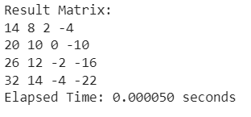

# EXPERIMENT 05: MATRIX MULTIPLICATION ON USING CUDA AND HOSTMatrix Multiplication on Host and GPU

## AIM:

To perform matrix multiplication using CUDA and compare the performance of the CPU and GPU implementations.

## PROCEDURE:

1. Create two matrices 'a' and 'b' and initialize them.
2. Allocate memory on the GPU for matrices 'a', 'b', and 'c'.
3. Copy matrices 'a' and 'b' from the host to the device.
4. Launch a CUDA kernel to perform matrix multiplication on the GPU, using a grid of blocks and threads.
5. Copy the result matrix 'c' from the device to the host.
6. Record the start and end times to measure the elapsed time of the GPU computation.
7. Free the allocated device memory.


## PROGRAM:
```cuda
%%cu
#include <stdio.h>
#include <assert.h>
#include <cuda_runtime.h>
#include <stdio.h>
#include <cuda.h>
#include <sys/time.h>

#define SIZE 4
#define BLOCK_SIZE 2

// Kernel function to perform matrix multiplication
__global__ void matrixMultiply(int *a, int *b, int *c, int size)
{
    int row = blockIdx.y * blockDim.y + threadIdx.y;
    int col = blockIdx.x * blockDim.x + threadIdx.x;

    int sum = 0;
    for (int k = 0; k < size; ++k)
    {
        sum += a[row * size + k] * b[k * size + col];
    }

    c[row * size + col] = sum;
}

int main()
{
    int a[SIZE][SIZE], b[SIZE][SIZE], c[SIZE][SIZE];
    int *dev_a, *dev_b, *dev_c;
    int size = SIZE * SIZE * sizeof(int);

    // Initialize matrices 'a' and 'b'
    for (int i = 0; i < SIZE; ++i)
    {
        for (int j = 0; j < SIZE; ++j)
        {
            a[i][j] = i + j;
            b[i][j] = i - j;
        }
    }

    // Allocate memory on the device
    cudaMalloc((void**)&dev_a, size);
    cudaMalloc((void**)&dev_b, size);
    cudaMalloc((void**)&dev_c, size);

    // Copy input matrices from host to device memory
    cudaMemcpy(dev_a, a, size, cudaMemcpyHostToDevice);
    cudaMemcpy(dev_b, b, size, cudaMemcpyHostToDevice);

    // Set grid and block sizes
    dim3 dimGrid(SIZE / BLOCK_SIZE, SIZE / BLOCK_SIZE);
    dim3 dimBlock(BLOCK_SIZE, BLOCK_SIZE);

    // Start timer
    struct timeval start, end;
    gettimeofday(&start, NULL);

    // Launch kernel
    matrixMultiply<<<dimGrid, dimBlock>>>(dev_a, dev_b, dev_c, SIZE);

    // Copy result matrix from device to host memory
    cudaMemcpy(c, dev_c, size, cudaMemcpyDeviceToHost);

    // Stop timer
    gettimeofday(&end, NULL);
    double elapsed_time = (end.tv_sec - start.tv_sec) + (end.tv_usec - start.tv_usec) / 1000000.0;

    // Print the result matrix
    printf("Result Matrix:\n");
    for (int i = 0; i < SIZE; ++i)
    {
        for (int j = 0; j < SIZE; ++j)
        {
            printf("%d ", c[i][j]);
        }
        printf("\n");
    }

    // Print the elapsed time
    printf("Elapsed Time: %.6f seconds\n", elapsed_time);

    // Free device memory
    cudaFree(dev_a);
    cudaFree(dev_b);
    cudaFree(dev_c);

    return 0;
}
```

## OUTPUT:

## RESULT:
The implementation of Matrix Multiplication using GPU is done successfully.