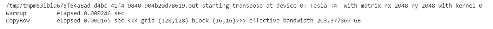

# EXPERIMENT 06:CUDA MATRIX TRANSPOSITION
## AIM:
To compare the performance of different matrix transposition implementations using CUDA.

## PROCEDURE:
1. Set up device properties and allocate host and device memory for the matrices.
2. Initialize host matrix with random values and transpose it as the reference.
3. Choose a transpose kernel based on the specified kernel index and block sizes.
4. Copy the host matrix to the device and perform a warm-up to avoid startup overhead.
5. Execute the selected transpose kernel on the device and measure the elapsed time.
6. Calculate the effective bandwidth of the operation.
7. Check and print the results if the chosen kernel involves data transposition.

## PROGRAM:
```cuda

%%cu
#include <cuda_runtime.h>
#include <stdio.h>

#include <stdio.h>
#include <cuda_runtime.h>
#include <cuda.h>
#include <sys/time.h>

#ifndef _COMMON_H
#define _COMMON_H

#define CHECK(call)                                                            \
{                                                                              \
    const cudaError_t error = call;                                            \
    if (error != cudaSuccess)                                                  \
    {                                                                          \
        fprintf(stderr, "Error: %s:%d, ", __FILE__, __LINE__);                 \
        fprintf(stderr, "code: %d, reason: %s\n", error,                       \
                cudaGetErrorString(error));                                    \
        exit(1);                                                               \
    }                                                                          \
}

#define CHECK_CUBLAS(call)                                                     \
{                                                                              \
    cublasStatus_t err;                                                        \
    if ((err = (call)) != CUBLAS_STATUS_SUCCESS)                               \
    {                                                                          \
        fprintf(stderr, "Got CUBLAS error %d at %s:%d\n", err, __FILE__,       \
                __LINE__);                                                     \
        exit(1);                                                               \
    }                                                                          \
}

#define CHECK_CURAND(call)                                                     \
{                                                                              \
    curandStatus_t err;                                                        \
    if ((err = (call)) != CURAND_STATUS_SUCCESS)                               \
    {                                                                          \
        fprintf(stderr, "Got CURAND error %d at %s:%d\n", err, __FILE__,       \
                __LINE__);                                                     \
        exit(1);                                                               \
    }                                                                          \
}

#define CHECK_CUFFT(call)                                                      \
{                                                                              \
    cufftResult err;                                                           \
    if ( (err = (call)) != CUFFT_SUCCESS)                                      \
    {                                                                          \
        fprintf(stderr, "Got CUFFT error %d at %s:%d\n", err, __FILE__,        \
                __LINE__);                                                     \
        exit(1);                                                               \
    }                                                                          \
}

#define CHECK_CUSPARSE(call)                                                   \
{                                                                              \
    cusparseStatus_t err;                                                      \
    if ((err = (call)) != CUSPARSE_STATUS_SUCCESS)                             \
    {                                                                          \
        fprintf(stderr, "Got error %d at %s:%d\n", err, __FILE__, __LINE__);   \
        cudaError_t cuda_err = cudaGetLastError();                             \
        if (cuda_err != cudaSuccess)                                           \
        {                                                                      \
            fprintf(stderr, "  CUDA error \"%s\" also detected\n",             \
                    cudaGetErrorString(cuda_err));                             \
        }                                                                      \
        exit(1);                                                               \
    }                                                                          \
}

inline double seconds()
{
    struct timeval tp;
    struct timezone tzp;
    int i = gettimeofday(&tp, &tzp);
    return ((double)tp.tv_sec + (double)tp.tv_usec * 1.e-6);
}

#endif // _COMMON_H


#define BDIMX 32
#define BDIMY 16
#define IPAD  2

void printData(char *msg, int *in,  const int size)
{
    printf("%s: ", msg);

    for (int i = 0; i < size; i++)
    {
        printf("%4d", in[i]);
        fflush(stdout);
    }

    printf("\n\n");
}

__global__ void setRowReadRow(int *out)
{
    // static shared memory
    __shared__ int tile[BDIMY][BDIMX];

    // mapping from thread index to global memory index
    unsigned int idx = threadIdx.y * blockDim.x + threadIdx.x;

    // shared memory store operation
    tile[threadIdx.y][threadIdx.x] = idx;

    // wait for all threads to complete
    __syncthreads();

    // shared memory load operation
    out[idx] = tile[threadIdx.y][threadIdx.x] ;
}

__global__ void setColReadCol(int *out)
{
    // static shared memory
    __shared__ int tile[BDIMX][BDIMY];

    // mapping from thread index to global memory index
    unsigned int idx = threadIdx.y * blockDim.x + threadIdx.x;

    // shared memory store operation
    tile[threadIdx.x][threadIdx.y] = idx;

    // wait for all threads to complete
    __syncthreads();

    // shared memory load operation
    out[idx] = tile[threadIdx.x][threadIdx.y];
}

__global__ void setColReadCol2(int *out)
{
    // static shared memory
    __shared__ int tile[BDIMY][BDIMX];

    // mapping from 2D thread index to linear memory
    unsigned int idx = threadIdx.y * blockDim.x + threadIdx.x;

    // convert idx to transposed coordinate (row, col)
    unsigned int irow = idx / blockDim.y;
    unsigned int icol = idx % blockDim.y;

    // shared memory store operation
    tile[icol][irow] = idx;

    // wait for all threads to complete
    __syncthreads();

    // shared memory load operation
    out[idx] = tile[icol][irow] ;
}

__global__ void setRowReadCol(int *out)
{
    // static shared memory
    __shared__ int tile[BDIMY][BDIMX];

    // mapping from 2D thread index to linear memory
    unsigned int idx = threadIdx.y * blockDim.x + threadIdx.x;

    // convert idx to transposed coordinate (row, col)
    unsigned int irow = idx / blockDim.y;
    unsigned int icol = idx % blockDim.y;

    // shared memory store operation
    tile[threadIdx.y][threadIdx.x] = idx;

    // wait for all threads to complete
    __syncthreads();

    // shared memory load operation
    out[idx] = tile[icol][irow];
}

__global__ void setRowReadColPad(int *out)
{
    // static shared memory
    __shared__ int tile[BDIMY][BDIMX + IPAD];

    // mapping from 2D thread index to linear memory
    unsigned int idx = threadIdx.y * blockDim.x + threadIdx.x;

    // convert idx to transposed (row, col)
    unsigned int irow = idx / blockDim.y;
    unsigned int icol = idx % blockDim.y;

    // shared memory store operation
    tile[threadIdx.y][threadIdx.x] = idx;

    // wait for all threads to complete
    __syncthreads();

    // shared memory load operation
    out[idx] = tile[icol][irow] ;
}

__global__ void setRowReadColDyn(int *out)
{
    // dynamic shared memory
    extern  __shared__ int tile[];

    // mapping from thread index to global memory index
    unsigned int idx = threadIdx.y * blockDim.x + threadIdx.x;

    // convert idx to transposed (row, col)
    unsigned int irow = idx / blockDim.y;
    unsigned int icol = idx % blockDim.y;

    // convert back to smem idx to access the transposed element
    unsigned int col_idx = icol * blockDim.x + irow;

    // shared memory store operation
    tile[idx] = idx;

    // wait for all threads to complete
    __syncthreads();

    // shared memory load operation
    out[idx] = tile[col_idx];
}

__global__ void setRowReadColDynPad(int *out)
{
    // dynamic shared memory
    extern  __shared__ int tile[];

    // mapping from thread index to global memory index
    unsigned int g_idx = threadIdx.y * blockDim.x + threadIdx.x;

    // convert idx to transposed (row, col)
    unsigned int irow = g_idx / blockDim.y;
    unsigned int icol = g_idx % blockDim.y;

    unsigned int row_idx = threadIdx.y * (blockDim.x + IPAD) + threadIdx.x;

    // convert back to smem idx to access the transposed element
    unsigned int col_idx = icol * (blockDim.x + IPAD) + irow;

    // shared memory store operation
    tile[row_idx] = g_idx;

    // wait for all threads to complete
    __syncthreads();

    // shared memory load operation
    out[g_idx] = tile[col_idx];
}

int main(int argc, char **argv)
{
    // set up device
    int dev = 0;
    double ielaps,istart;
    cudaDeviceProp deviceProp;
    CHECK(cudaGetDeviceProperties(&deviceProp, dev));
    printf("%s at ", argv[0]);
    printf("device %d: %s ", dev, deviceProp.name);
    CHECK(cudaSetDevice(dev));

    cudaSharedMemConfig pConfig;
    CHECK(cudaDeviceGetSharedMemConfig ( &pConfig ));
    printf("with Bank Mode:%s ", pConfig == 1 ? "4-Byte" : "8-Byte");

    // set up array size
    int nx = BDIMX;
    int ny = BDIMY;

    bool iprintf = 0;

    if (argc > 1) iprintf = atoi(argv[1]);

    size_t nBytes = nx * ny * sizeof(int);

    // execution configuration
    dim3 block (BDIMX, BDIMY);
    dim3 grid  (1, 1);
    printf("<<< grid (%d,%d) block (%d,%d)>>>\n", grid.x, grid.y, block.x,
            block.y);

    // allocate device memory
    int *d_C;
    CHECK(cudaMalloc((int**)&d_C, nBytes));
    int *gpuRef  = (int *)malloc(nBytes);

    CHECK(cudaMemset(d_C, 0, nBytes));
    istart=seconds();
    setRowReadRow<<<grid, block>>>(d_C);
    ielaps=seconds()-istart;
    printf("\nSetRowReadRow Elpased Time: %f\n",ielaps);
    CHECK(cudaMemcpy(gpuRef, d_C, nBytes, cudaMemcpyDeviceToHost));

    if(iprintf)  printData("setRowReadRow       ", gpuRef, nx * ny);

    CHECK(cudaMemset(d_C, 0, nBytes));
    istart=seconds();
    setColReadCol<<<grid, block>>>(d_C);
    ielaps=seconds()-istart;
    printf("SetColReadCol Elpased Time: %f\n",ielaps);
    CHECK(cudaMemcpy(gpuRef, d_C, nBytes, cudaMemcpyDeviceToHost));

    if(iprintf)  printData("setColReadCol       ", gpuRef, nx * ny);

    CHECK(cudaMemset(d_C, 0, nBytes));
    istart=seconds();
    setColReadCol2<<<grid, block>>>(d_C);
    ielaps=seconds()-istart;
    printf("SetColReadCol2 Elpased Time: %f\n",ielaps);
    CHECK(cudaMemcpy(gpuRef, d_C, nBytes, cudaMemcpyDeviceToHost));

    if(iprintf)  printData("setColReadCol2      ", gpuRef, nx * ny);

    CHECK(cudaMemset(d_C, 0, nBytes));
    istart=seconds();
    setRowReadCol<<<grid, block>>>(d_C);
    ielaps=seconds()-istart;
    printf("SetRowReadCol Elpased Time: %f\n",ielaps);
    CHECK(cudaMemcpy(gpuRef, d_C, nBytes, cudaMemcpyDeviceToHost));

    if(iprintf)  printData("setRowReadCol       ", gpuRef, nx * ny);

    CHECK(cudaMemset(d_C, 0, nBytes));
    istart=seconds();
    setRowReadColDyn<<<grid, block, BDIMX*BDIMY*sizeof(int)>>>(d_C);
    ielaps=seconds()-istart;
    printf("SetRowReadColDyn Elpased Time: %f\n",ielaps);
    CHECK(cudaMemcpy(gpuRef, d_C, nBytes, cudaMemcpyDeviceToHost));

    if(iprintf)  printData("setRowReadColDyn    ", gpuRef, nx * ny);

    CHECK(cudaMemset(d_C, 0, nBytes));
    istart=seconds();
    setRowReadColPad<<<grid, block>>>(d_C);
    ielaps=seconds()-istart;
    printf("RowReadColPad Elpased Time: %f\n",ielaps);
    CHECK(cudaMemcpy(gpuRef, d_C, nBytes, cudaMemcpyDeviceToHost));

    if(iprintf)  printData("setRowReadColPad    ", gpuRef, nx * ny);

    CHECK(cudaMemset(d_C, 0, nBytes));
    istart=seconds();
    setRowReadColDynPad<<<grid, block, (BDIMX + IPAD)*BDIMY*sizeof(int)>>>(d_C);
     ielaps=seconds()-istart;
    printf("SetRowReadColDyn Elpased Time: %f\n",ielaps);
    CHECK(cudaMemcpy(gpuRef, d_C, nBytes, cudaMemcpyDeviceToHost));

    if(iprintf)  printData("setRowReadColDynPad ", gpuRef, nx * ny);

    // free host and device memory
    CHECK(cudaFree(d_C));
    free(gpuRef);


    // reset device
    CHECK(cudaDeviceReset());
    return EXIT_SUCCESS;
}
```
## OUTPUT:

## RESULT:
The Matrix transposition on shared memory with grid (1,1) block (16,16) is demonstrated successfully.
